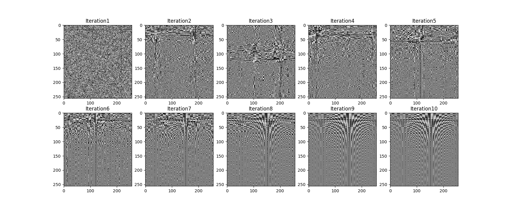
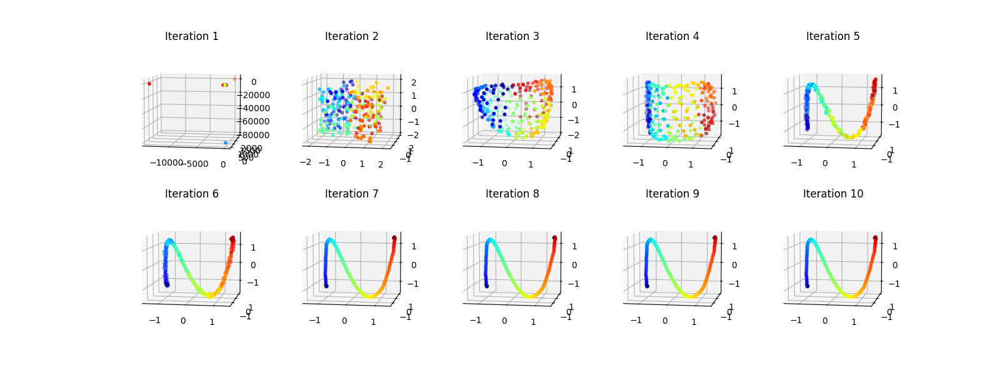
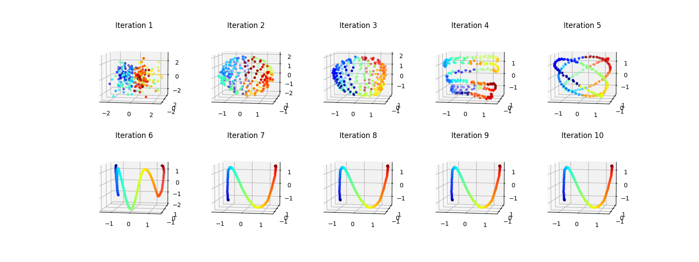
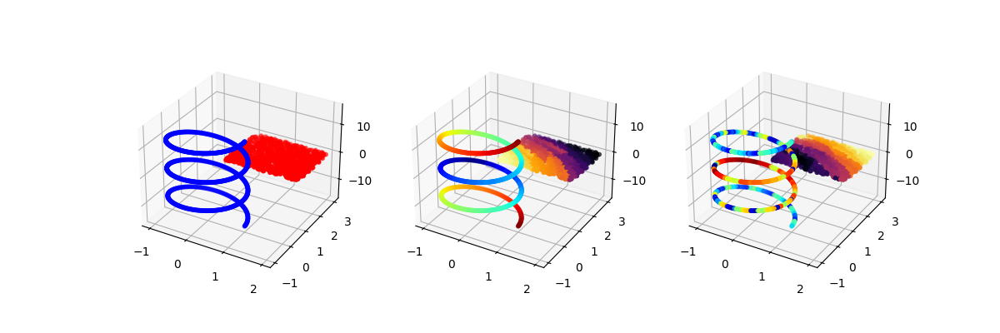
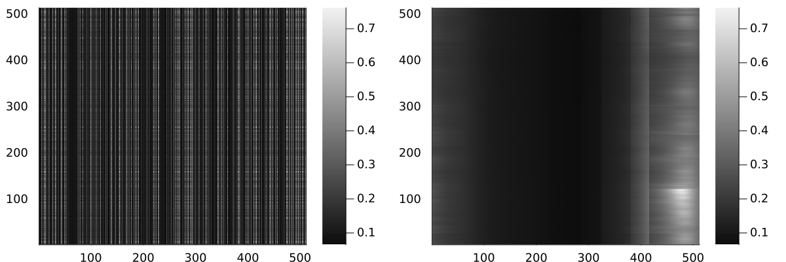

# QuestionnaireFastTransform

GPU-accelerated **Questionnaire algorithm** for hierarchical coupled geometry analysis, with **Walsh** (EGHWT) and **Butterfly** factorization for fast matrix compression.

> **v2.0 — Rewritten in Python.** The original [v1.0](https://github.com/pei-chun-su/QuestionnaireFastTransform.jl/tree/v1.0-julia) was a Julia package that called Python's pyquest via PyCall. This version is a **pure Python implementation** with the following improvements:
>
> - **No Julia dependency** — runs anywhere with Python 3.8+ and NumPy/SciPy
> - **GPU acceleration** — optional CuPy/PyTorch backend for multi-GPU affinity and EMD (`questionnaire_gpu.py`)
> - **Walsh (EGHWT) ported to Python** — the full 2D Extended Graph Haar-Walsh Transform (analysis, best-basis selection, synthesis, fast multiplication) previously only available in Julia's [MultiscaleGraphSignalTransforms.jl](https://github.com/UCD4IDS/MultiscaleGraphSignalTransforms.jl) is now implemented in `Walsh.py`
> - **Butterfly factorization ported to Python** — hierarchical interpolative decomposition with O(N log N) operator application in `Butterfly.py`
> - **Unified example script** — single CLI for Helmholtz kernel experiments with both Walsh and Butterfly, across multiple matrix sizes

## Overview

Given an arbitrary matrix (e.g., a kernel matrix between two point clouds), the Questionnaire algorithm discovers the hidden geometric structure of its rows and columns through an iterative dual-affinity procedure. The learned hierarchical trees then enable two complementary compression strategies:

- **Walsh (EGHWT)**: 2D best-basis selection on the Extended Graph Haar-Walsh Transform dictionary. Achieves sparse representation by selecting the most energy-efficient time-frequency atoms.
- **Butterfly factorization**: Hierarchical interpolative decomposition (ID) on dyadic blocks induced by the row/column trees. Achieves O(N log N) matrix-vector products.

### Pipeline

```
Input matrix A (N x N, unknown row/column ordering)
        |
        v
  [1] Questionnaire algorithm
      - Cosine/Gaussian affinity -> binary/flexible tree -> EMD dual affinity
      - Iterates between row and column geometry
      - Discovers hierarchical row tree T_r and column tree T_c
        |
        v
  [2] Permutation & Reorganization
      - Reorder rows/columns by tree leaf ordering
      - Reveals dyadic block-rank structure
        |
        v
  [3a] Walsh (EGHWT)              [3b] Butterfly factorization
       - 2D best-basis selection        - Dyadic block partition
       - Energy thresholding            - Hierarchical ID at each level
       - Sparse coefficient set         - Skeleton + interpolation factors
        |                                |
        v                                v
  Fast mat-vec via                 Fast mat-vec via
  Walsh coefficient filtering      recursive factor application
```

## What Changed from v1.0 (Julia)

| | v1.0 (Julia) | v2.0 (Python) |
|---|---|---|
| **Language** | Julia + PyCall → Python pyquest | Pure Python |
| **Walsh transform** | Julia (MultiscaleGraphSignalTransforms.jl) | Python (`Walsh.py`) |
| **Butterfly** | Julia | Python (`Butterfly.py`) |
| **Questionnaire** | Python pyquest via PyCall | Python (`questionnaire.py` / `questionnaire_gpu.py`) |
| **GPU support** | None | CuPy + PyTorch multi-GPU |
| **Dependencies** | Julia 1.9+, Conda, PyCall, 19 Julia packages | Python 3.8+, NumPy, SciPy, scikit-learn |
| **Setup** | `Pkg.activate`, `Conda.add`, `Pkg.build("PyCall")` | `pip install -r requirements.txt` |

## Installation

```bash
git clone https://github.com/pei-chun-su/QuestionnaireFastTransform.git
cd QuestionnaireFastTransform
pip install -r requirements.txt
```

For GPU acceleration (optional), install [CuPy](https://cupy.dev/) and [PyTorch](https://pytorch.org/) matching your CUDA version:

```bash
pip install cupy-cuda12x torch
```

## Quick Start

```python
import sys
sys.path.append('pyquest')

import numpy as np
from scipy.spatial.distance import cdist
import questionnaire as qcoif
from bin_tree_build import bin_tree_build4
from Butterfly import dyadic_partition, compress_dyadic_blocks, apply_compressed_operator
from Walsh import ghwt_core, ghwt_2d_sparse, walsh_multiplication_fast

# Generate a Helmholtz kernel matrix
n = 1024
z1 = np.random.rand(3, n)             # source points
z2 = np.random.rand(3, n)             # target points
D = cdist(z1.T, z2.T)
K = np.cos(2 * np.pi * D) / D         # Helmholtz Green's function

# Randomly permute (simulates unknown ordering)
perm_r, perm_c = np.random.permutation(n), np.random.permutation(n)
A = K[perm_r][:, perm_c]

# Step 1: Questionnaire — discover geometry
# Use questionnaire_gpu.py instead for GPU acceleration:
#   import questionnaire_gpu as qcoif
#   add ngpu=<num_gpus> and ntile=1000 to params
params = qcoif.PyQuestParams(
    qcoif.INIT_AFF_COS_SIM,
    qcoif.TREE_TYPE_BINARY,
    qcoif.DUAL_EMD,
    qcoif.DUAL_EMD,
    threshold=0.0, knn=int(np.ceil(n**0.5)),
    epsilon=10, n_iters=5, diag_bias=True,
)
qrun = qcoif.pyquest(A, params)

# Step 2: Butterfly compression
row_tree = qrun.row_trees[-1]
col_tree = qrun.col_trees[-1]
level_blocks, level_infos = dyadic_partition(A, row_tree, col_tree, C_max=64)
BL, P = compress_dyadic_blocks(level_blocks, acc=1e-10)

# Fast matrix-vector product
x = np.random.rand(n)
f_approx = apply_compressed_operator(BL, P, x, level_infos)
f_exact = A @ x
print(f"Relative error: {np.linalg.norm(f_approx - f_exact) / np.linalg.norm(f_exact):.2e}")
```

## Example: Helmholtz Kernel

The `examples/helmholtz_kernel.py` script runs the full pipeline on the Helmholtz Green's function kernel `K(x,y) = cos(2*pi*|x-y|) / |x-y|` between a thin plane and a 3D spiral, comparing Walsh and Butterfly compression across multiple matrix sizes.

```bash
# Run with default sizes (512, 1024, 2048) — CPU questionnaire
python examples/helmholtz_kernel.py

# Custom sizes, Butterfly only
python examples/helmholtz_kernel.py --sizes 256 512 1024 2048 4096 --method butterfly

# Use GPU-accelerated questionnaire (requires cupy + torch)
python examples/helmholtz_kernel.py --sizes 1024 2048 4096 --gpu
```

### DST-IV: Geometry Discovery over 10 Iterations

The Questionnaire algorithm progressively discovers the row and column geometry of the DST-IV kernel `K(k, x_i) = sin(pi * (k-0.5) * (i-0.5) / N)` from a randomly permuted matrix. The reorganized matrix reveals the analytic structure over iterations:



Row embedding (frequency domain) across iterations — the algorithm recovers the sinusoidal structure:



Column embedding (spatial domain) across iterations:



### Helmholtz Kernel: Geometry Setup

The Helmholtz kernel `K(x,y) = cos(2*pi*||x-y||) / ||x-y||` models acoustic wave interactions between a 3D spiral (blue) and a thin plane (red). **Left**: the two point clouds. **Middle/Right**: the Questionnaire discovers the clustering structure from the kernel entries alone, coloring points by learned tree ordering:



Before and after reorganization — the randomly permuted matrix (left) is transformed into a structured, compressible form (right):



### Expected Results

Results from [Su & Coifman (2025)](https://arxiv.org/abs/2506.11990), Tables 1-3. All entries stored in Float64. Questionnaire parallelized across 6 NVIDIA RTX A4500 GPUs; all other algorithms single-threaded CPU.

#### DST-IV: `K(k, x_i) = sin(pi * (k-0.5) * (i-0.5) / N)`

| N | Direct (s) | Quest. (s) | BF Prep (s) | BF Memory (MiB) | BF Mat-Vec (s) | BF Error | eGHWT Prep (s) | eGHWT Memory (MiB) | eGHWT Mat-Vec (s) | eGHWT Error |
|---|---|---|---|---|---|---|---|---|---|---|
| 1024 | 5.71E-4 | 89 | 1.4 | 6.59 | 1.05E-3 | 9.42E-12 | 29.8 | 10.0 | 0.176 | 3.92E-2 |
| 2048 | 6.86E-3 | 115 | 9.24 | 20.6 | 2.45E-3 | 2.09E-11 | 177 | 38.3 | 0.969 | 4.92E-2 |
| 4096 | 1.66E-2 | 276 | 189 | 63.2 | 8.60E-3 | 1.54E-11 | 730 | 158 | 3.61 | 4.92E-2 |
| 8192 | 6.80E-2 | 1050 | 570 | 150 | 1.82E-2 | 1.45E-11 | 4310 | 638 | 14.0 | 4.97E-2 |
| 16384 | 0.33 | 4470 | 1530 | 426 | 3.71E-2 | 1.12E-11 | 22800 | 1980 | 43.3 | 4.70E-2 |
| 32768 | 1.29 | 13000 | 4030 | 1450 | 6.24E-2 | 1.75E-11 | — | — | — | — |

#### Helmholtz kernel: `K(x, y) = cos(2*pi*||x-y||) / ||x-y||`

| N | Direct (s) | Quest. (s) | BF Prep (s) | BF Memory (MiB) | BF Mat-Vec (s) | BF Error | eGHWT Prep (s) | eGHWT Memory (MiB) | eGHWT Mat-Vec (s) | eGHWT Error |
|---|---|---|---|---|---|---|---|---|---|---|
| 1024 | 9.14E-4 | 56.1 | 0.485 | 3.99 | 4.61E-4 | 2.43E-11 | 31.8 | 13.2 | 0.353 | 2.89E-4 |
| 2048 | 6.08E-3 | 87.8 | 1.55 | 9.93 | 1.96E-3 | 2.67E-11 | 172 | 38.1 | 0.981 | 2.07E-4 |
| 4096 | 2.56E-2 | 274 | 4.94 | 20.4 | 3.78E-3 | 2.27E-11 | 738 | 94.0 | 2.36 | 1.61E-4 |
| 8192 | 8.13E-2 | 1140 | 22.2 | 56.0 | 8.02E-3 | 2.71E-11 | 3790 | 219 | 5.41 | 1.37E-4 |
| 16384 | 0.333 | 2670 | 76.8 | 168 | 1.62E-2 | 2.66E-11 | 22700 | 448 | 11.4 | 1.23E-4 |
| 32768 | 1.32 | 16000 | 301 | 574 | 3.79E-2 | 2.28E-11 | — | — | — | — |

**Butterfly** achieves machine-precision accuracy (~1e-11) with O(N log N) mat-vec. **eGHWT** achieves moderate accuracy (~1e-4) with a sparser representation; its best-basis selection requires O(N^2 (log N)^2) memory, limiting scalability beyond N=16384.

## Library Structure

```
QuestionnaireFastTransform/
├── README.md
├── requirements.txt
├── pyquest/                          # Core library
│   ├── questionnaire.py              # CPU questionnaire pipeline
│   ├── questionnaire_gpu.py          # GPU-accelerated questionnaire (CuPy + PyTorch)
│   ├── affinity.py                   # CPU initial affinity (cosine, Gaussian)
│   ├── affinity_gpu2.py              # GPU initial affinity (multi-GPU tiled)
│   ├── aff_util2.py                  # GPU worker functions for affinity
│   ├── dual_affinity.py              # CPU EMD dual affinity
│   ├── dual_affinity_gpu2.py         # GPU EMD dual affinity
│   ├── bin_tree_build.py             # Binary tree via spectral bisection
│   ├── flex_tree_build.py            # Flexible tree via agglomerative clustering
│   ├── Mytree.py                     # Tree data structure (ClusterTreeNode)
│   ├── tree_util.py                  # CPU tree operations (sums, averages)
│   ├── tree_util_gpu.py              # GPU tree operations (sparse @ dense)
│   ├── markov.py                     # Markov chain eigenanalysis (CPU)
│   ├── markov_gpu.py                 # Markov chain eigenanalysis (GPU)
│   ├── transform.py                  # Tree-based data transforms
│   ├── haar.py                       # Haar-like wavelet basis on trees
│   ├── Walsh.py                      # GHWT (Graph Haar-Walsh Transform) — ported from Julia
│   ├── Butterfly.py                  # Butterfly factorization (hierarchical ID) — ported from Julia
│   └── imports.py                    # Common imports
└── examples/
    └── helmholtz_kernel.py           # Full Helmholtz kernel example
```

### Core Modules

| Module | Purpose |
|--------|---------|
| `questionnaire.py` / `questionnaire_gpu.py` | Main pipeline: iterates between row and column affinities to discover dual geometry |
| `dual_affinity.py` / `dual_affinity_gpu2.py` | Earth Mover's Distance (EMD) computation using tree-weighted cityblock distances |
| `bin_tree_build.py` | Binary tree construction via Fiedler vector (2nd eigenvector) spectral bisection |
| `Walsh.py` | Extended Graph Haar-Walsh Transform: 2D analysis, best-basis selection, sparse approximation, and fast synthesis/multiplication |
| `Butterfly.py` | Hierarchical butterfly factorization: dyadic block partition, interpolative decomposition at each level, and fast operator application |

### GPU vs CPU

| Component | CPU | GPU |
|-----------|-----|-----|
| Questionnaire | `questionnaire.py` | `questionnaire_gpu.py` |
| Initial affinity | `affinity.py` | `affinity_gpu2.py` + `aff_util2.py` |
| Dual affinity (EMD) | `dual_affinity.py` | `dual_affinity_gpu2.py` |
| Tree operations | `tree_util.py` | `tree_util_gpu.py` |
| Eigenanalysis | `markov.py` | `markov_gpu.py` |
| Walsh compression | `Walsh.py` (CPU only) | — |
| Butterfly factorization | `Butterfly.py` (CPU only) | — |

The GPU modules use [CuPy](https://cupy.dev/) for array operations and sparse linear algebra, and [PyTorch](https://pytorch.org/) for cosine similarity computation. Multi-GPU parallelization is handled via Python's `multiprocessing` with round-robin GPU assignment.

## Algorithm Details

### Questionnaire Algorithm

The questionnaire iterates between row and column geometry:

1. Compute initial row affinity (cosine similarity or Gaussian kernel)
2. Build row tree via spectral bisection (binary) or agglomerative clustering (flexible)
3. Compute column affinity via Earth Mover's Distance using row tree
4. Build column tree
5. Compute row affinity via EMD using column tree
6. Repeat for N iterations

The EMD between two columns uses the row tree to define a multi-scale metric:

```
EMD(col_i, col_j) = sum over nodes v:
    w(v) * |avg(col_i over v) - avg(col_j over v)|
```

where `w(v) = (|v|/N)^beta * 2^((1-level(v))*alpha)`.

### Butterfly Factorization

Given row tree T_r and column tree T_c:

1. **Dyadic partition**: Create blocks at each level by pairing row nodes (coarse to fine) with column nodes (fine to coarse)
2. **Level 0**: Apply interpolative decomposition (ID) to each block: `A ≈ A[:,Js] @ Z`
3. **Levels 1..L**: Merge child skeletons, apply ID to merged block
4. **Application**: Recursive back-substitution through the tree levels

Complexity: O(N log N) for mat-vec (vs. O(N^2) direct). Construction cost is O(N^{3/2}).

### Walsh (EGHWT) Compression

1. **Analysis**: Expand the matrix in the 2D GHWT dictionary (rows then columns)
2. **Best-basis selection**: Greedy comparison of time vs. frequency cost at each scale
3. **Thresholding**: Retain coefficients capturing (1 - acc^2) of total energy
4. **Fast multiplication**: Apply the sparse Walsh representation to a vector

## References

- P.-C. Su and R. R. Coifman, "Extracting Dual Analytic Geometries of Linear Transformations to Achieve Efficient Computation," arXiv:2506.11990, 2025.
- N. Saito and Y. Shao, "eGHWT: The Extended Generalized Haar-Walsh Transform," Journal of Mathematical Imaging and Vision, vol. 64, 2022.
- G. Mishne, R. Talmon, I. Cohen, R. R. Coifman and Y. Kluger, "Data-Driven Tree Transforms and Metrics," IEEE Transactions on Signal and Information Processing over Networks, vol. 4, 2017.
- G. Mishne, R. Talmon, R. Meir, J. Schiller, U. Dubin and R. R. Coifman, "Hierarchical Coupled Geometry Analysis for Neuronal Structure and Activity Pattern Discovery," IEEE JSTSP, vol. 10, no. 7, pp. 1238-1253, Oct. 2016.
- J. I. Ankenman, "Geometry and analysis of dual networks on questionnaires," Ph.D. dissertation, Yale University, 2014.
- M. O'Neil, F. Woolfe, and V. Rokhlin, "An algorithm for the rapid evaluation of special function transforms," Applied and Computational Harmonic Analysis, vol. 28, 2010.

## License

MIT License
