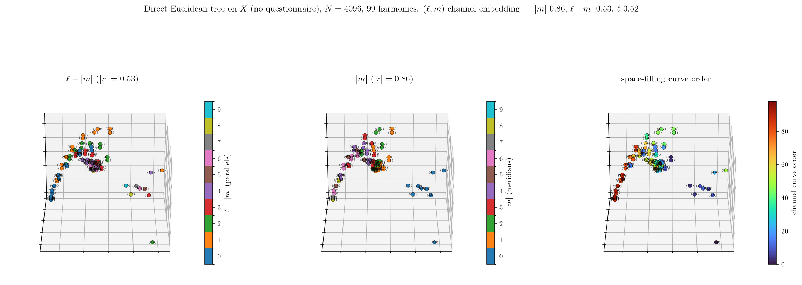
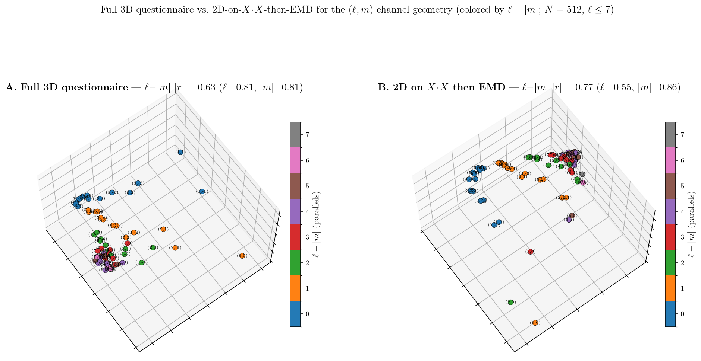
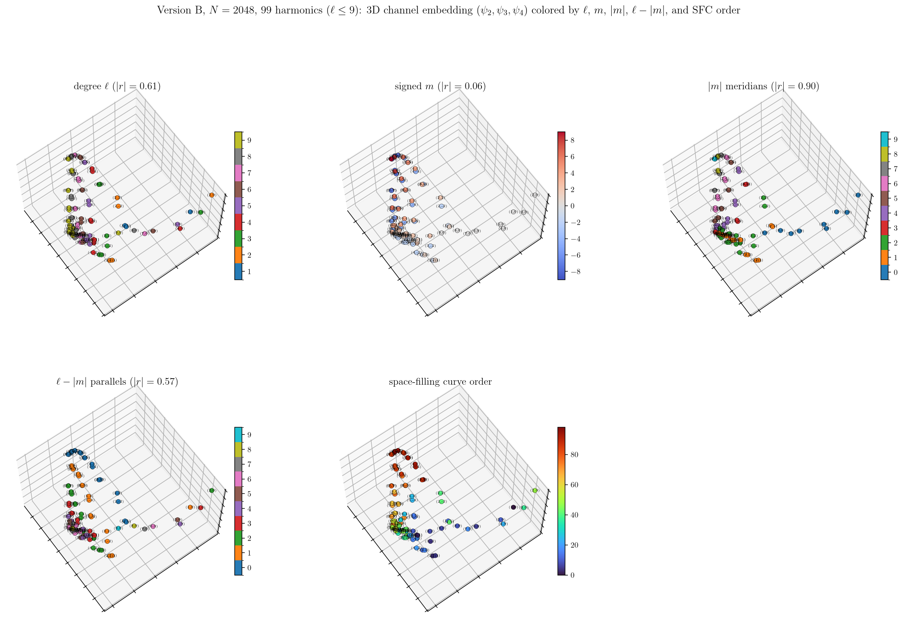

# Spherical Harmonic Questionnaire

Examples that probe the **dual geometry of the spherical harmonics** with the
QuestionnaireFastTransform toolbox. From a single tensor and one tree–Earth-Mover
metric, the method threads the sphere's points into a **space-filling curve** and lays
the harmonics out as a **frequency lattice** — organized by their nodal-line counts,
without ever being told the functions are harmonics or that the space is a sphere.



## Introduction

The real spherical harmonics $Y_\ell^m$ are the eigenfunctions of the Laplace–Beltrami
operator on $S^2$. Each has exactly $\ell$ nodal lines, split into two geometrically
distinct families:

$$\ell \;=\; \underbrace{|m|}_{\text{meridians (longitude)}} \;+\; \underbrace{(\ell-|m|)}_{\text{parallels (latitude)}}.$$

**Construction.** Take $N$ points $x_1,\dots,x_N$ uniformly on the sphere and form a
three-way tensor whose third mode is the harmonic index $(\ell,m)$:

$$\mathsf{T}[i,j,(\ell,m)] \;=\; Y_\ell^m(\theta_{ij},\phi_{ij}),$$

where $\cos\theta_{ij}=\langle x_i,x_j\rangle$ and $\phi_{ij}$ is the azimuth of $x_j$
in a local frame at $x_i$: north pole $x_i$, and an **east pole** taken as the sphere
point most nearly orthogonal to $x_i$ ($\arg\min_j|\langle x_i,x_j\rangle|$), projected
into the tangent plane. (The tree–EMD is shift-invariant, so no nonnegativity shift on
the tensor is needed.)

**Method.** Learn a hierarchical tree on the sphere, then measure the $(\ell,m)$ channel
geometry by a 2-D tree–EMD (`dual_affinity.calc_2demd`) *through* that tree, and read
the geometry from its diffusion embedding. Three ways to get the tree, all giving the
same channel geometry:

| Pipeline | Sphere tree from | Cost |
|---|---|---|
| **A. Full 3D questionnaire** | iterated `questionnaire.pyquest3d` on the tensor | heavy |
| **B. 2D-then-EMD** | 2D `questionnaire.pyquest` on the Gram $X\!\cdot\!X^\top$, then **one** `calc_2demd` | light |
| **C. Direct Euclidean tree** | Gaussian kNN affinity on Euclidean distance (no questionnaire) | lightest |

## Key findings

- **The channels sort by meridian count $|m|$** — $|r|\!\approx\!0.86$–$0.90$ (max
  correlation of a single embedding axis with $|m|$), stable from $N{=}512$ to $4096$
  and across all three tree constructions.
- **Degree $\ell$ and parallel count $\ell-|m|$ are secondary** ($|r|\!\approx\!0.5$–$0.6$).
- **The sign of $m$ is not recovered** ($|r|\!\lesssim\!0.06$) — it is a $\cos/\sin$ phase
  convention, not a geometric quantity, so the geometry never sees it.
- **The questionnaire is not required** — a plain Euclidean-Gaussian tree gives the same
  answer. The organization is a property of the *sphere metric*, not the tree method.
- **The spatial tree is harmonic-independent**, so it can be reused across harmonic
  counts (adding harmonics is nearly free — see `quest_B_L9.py`).
- The learned tree also yields a continuous **space-filling curve** on the sphere
  (`sfc_plot.py`) — the point-side of the same dual geometry.

<p align="center">
 
</p>

## Scripts

| Script | What it does | Figure |
|---|---|---|
| `quest3d_eastNN.py` | Pipeline **A**: full 3D questionnaire on the SH tensor (data-driven east pole) | — |
| `compare_3d_vs_2d.py` | **A vs B** on the identical sphere/tensor; correlations + side-by-side embeddings | `compare_3d_vs_2d.png` |
| `quest_B_N2048.py` | Pipeline **B** at $N{=}2048$ (2D questionnaire on the Gram, then one EMD) | — |
| `quest_B_L9.py` | Pipeline **B**, 99 harmonics ($\ell\le9$), **reusing** the saved $X\!\cdot\!X$ tree | — |
| `quest_euclid_tree.py` | Pipeline **C**: tree from a Euclidean-Gaussian affinity, $N{=}4096$ | `quest_euclid_tree.png` |
| `east_pole_dist.py` | Distribution of $\min_j|\langle x_i,x_j\rangle|$ vs $N$ (scales $\sim1/N$) | `east_pole_dist.png` |
| `sfc_plot.py` | Sphere space-filling curve from the learned tree | `sfc_plot.png` |
| `sfc_on_lattice.py`, `sfc_on_lattice_nlat.py` | Channel SFC drawn on the $(\ell,m)$ lattice (by SFC order / by $\ell-|m|$) | — |
| `quest_B_L9_5colors.py`, `_v2.py` | Channel embedding colored by $\ell$, $m$, $|m|$, $\ell-|m|$, SFC order | `quest_B_L9_5colors.png` |
| `quest_B_L9_views.py`, `quest_B_N2048_views.py` | The channel embedding from many viewing directions | `quest_B_L9_views.png` |
| `tsne_channels.py`, `umap_channels.py` | t-SNE / UMAP of the channel affinity (nonlinear cross-check) | `tsne_channels.png`, `umap_channels.png` |

Typical order: run a pipeline script (A/B/C) to produce the channel affinity and a
`*_data.npz`, then the `*_5colors` / `*_views` / `sfc_*` / `tsne_` / `umap_` replot
scripts read that `.npz`. `quest_B_L9.py` reads `quest_B_N2048_data.npz` (reuses its tree).

## Running

The scripts import the toolbox through the bundled `flip_questionnaire.py`, which adds
`../../pyquest` to the path — so just run them from this folder:

```bash
cd examples/spherical_harmonics
python quest_euclid_tree.py
```

Each script writes its `.png`/`.pdf` (and, for pipeline runs, a `.npz`) next to itself;
the curated result figures live in `figures/`.

**Dependencies:** the toolbox's `numpy`, `scipy`, `matplotlib`, plus **`scikit-learn`**
(t-SNE) and **`umap-learn`** (UMAP) for the two nonlinear-embedding examples. LaTeX is
used for figure text (matplotlib `text.usetex=True`); disable it in the scripts if you
don't have a TeX install.
